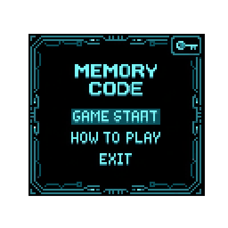

# GameProject

-작성자: 석승민

-작성일: 2026 -08-30

-게임제목: MEMORY

## 게임 방식

- 화면에 일정 시간 동안 나타나는 숫자 또는 문자열을 기억한 후,
화면에서 사라진 정보를 정확하게 입력하는 방식의 게임이다. 
플레이어는 스테이지가 올라갈수록 더 긴 숫자를 기억해야 하며, 
최대한 높은 단계까지 도달하는 것을 목표를 한다.

## 게임 목표

플레이어는 화면에 표시되는 숫자를 제한된 시간 동안 기억해야 한다.

숫자가 사라진 후 기억한 숫자를 입력하고, 정답일 경우 다음 단계로 진행한다.

단계가 올라갈수록 기억해야 하는 숫자의 개수가 증가하여 난이도가 상승한다.

최종 목표는 최대한	 높은 레벨에 도달하는 것이다.

## 게임 진행 방식
게임 시작

메인 화면에서 게임 시작을 선택하면 게임이 시작된다.

========================
       MEMORY CODE
========================

1. 게임 시작
2. 게임 설명
3. 종료

선택 :
숫자 표시

게임이 시작되면 화면에 기억해야 할 숫자가 나타난다.

예시:

========================

        LEVEL 1

        8 3 1 9 4

    숫자를 기억하세요!

========================

일정 시간이 지나면 숫자가 화면에서 사라진다.

숫자 입력

숫자가 사라진 후 플레이어가 기억한 숫자를 입력한다.

========================

        LEVEL 1

숫자를 입력하세요.

> 83194

========================

입력한 숫자가 정답과 동일하면 다음 단계로 이동한다.

## 레벨 시스템

레벨이 올라갈수록 기억해야 하는 숫자의 개수가 증가한다.

LEVEL	숫자 개수
1	3개
2	4개
3	5개
4	6개
5	7개
6	8개
7	9개
8	10개
9	11개
10	12개

LEVEL 10까지 도달하면 게임 클리어로 처리한다.

## 난이도 시스템

게임의 난이도는 크게 두 가지 방법으로 증가한다.

① 기억해야 하는 숫자의 증가

초반에는 3개의 숫자만 기억하면 되지만, 레벨이 올라갈수록 숫자의 개수가 증가한다.

② 숫자 표시 시간 감소

높은 레벨에서는 숫자가 화면에 표시되는 시간이 짧아진다.

예시:

LEVEL 1
숫자 3개
표시 시간 3초

LEVEL 5
숫자 7개
표시 시간 2초

LEVEL 10
숫자 12개
표시 시간 1초

이를 통해 단순히 숫자의 길이만 증가하는 것이 아니라 기억력과 집중력을 동시에 요구하도록 한다.

## 점수 시스템

정답을 맞힐 때마다 점수를 획득한다.

기본 점수:

획득 점수 = 현재 LEVEL × 100

예시:

LEVEL 1 → +100점
LEVEL 2 → +200점
LEVEL 3 → +300점

높은 레벨에서 정답을 맞힐수록 더 많은 점수를 얻을 수 있다.

## 목숨 시스템

플레이어에게 총 3개의 목숨이 주어진다.

숫자를 잘못 입력하면 목숨이 1개 감소한다.

LIFE : ♥ ♥ ♥

입력 실패!

LIFE : ♥ ♥

목숨이 모두 사라지면 게임 오버가 된다.

========================
       GAME OVER
========================

최종 LEVEL : 5
최종 SCORE : 1200

1. 다시 시작
2. 메인 메뉴
3. 종료
9. 보너스 시스템

특정 조건을 만족하면 보너스 점수를 획득할 수 있다.

연속 정답

3번 연속으로 정답을 맞힐 경우:

COMBO x3!

BONUS +500

이를 통해 플레이어가 계속해서 집중하도록 유도한다.

## 게임 화면 구성
메인 메뉴

========================
       MEMORY CODE
========================

1. 게임 시작
2. 게임 설명
3. 종료

선택 :
게임 화면
========================
LEVEL : 4
SCORE : 600
LIFE  : ♥ ♥ ♥

기억하세요!

7 2 9 4 1 8

========================
        입력 화면
========================

 
 

기억한 숫자를 입력하세요.

> 729418

========================
정답 화면
========================
 

        CORRECT!

        +400 POINT

        LEVEL UP!

========================
오답 화면
========================
 

        WRONG!

정답 : 729418
입력 : 729418

LIFE -1

========================
## 핵심 게임 시스템
① 랜덤 숫자 생성

게임 시작 시 랜덤 함수를 이용하여 숫자를 생성한다.

각 레벨마다 새로운 숫자가 생성되기 때문에 같은 패턴이 반복되지 않는다.

② 숫자 표시

생성된 숫자를 화면에 출력한다.

③ 숫자 숨기기

일정 시간이 지나면 화면을 지워 플레이어가 숫자를 볼 수 없도록 한다.

④ 플레이어 입력

플레이어가 기억한 숫자를 직접 입력한다.

⑤ 정답 판정

플레이어의 입력값과 정답을 비교한다.

입력값 == 정답
        ↓
      정답
        ↓
    다음 LEVEL

틀린 경우:

입력값 != 정답
        ↓
      오답
        ↓
     LIFE -1
## 게임 종료 조건
게임 클리어

LEVEL 10까지 성공하면 게임 클리어.

========================
      CONGRATULATIONS!
========================

      MEMORY MASTER

최종 SCORE : 5500

모든 LEVEL을 클리어했습니다!

========================
게임 오버

목숨이 0이 되면 게임 종료.

## 예상 플레이 시간

한 번의 플레이는 약 5~15분 정도로 예상한다.

플레이어가 높은 레벨에 도전하면서 반복 플레이할 수 있으며, 자신의 최고 점수를 갱신하는 것을 목표로 한다.